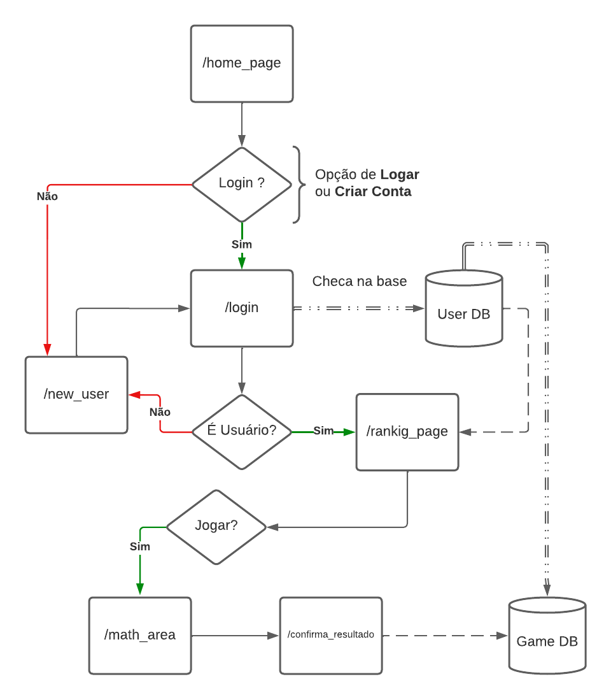
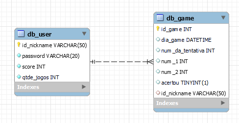
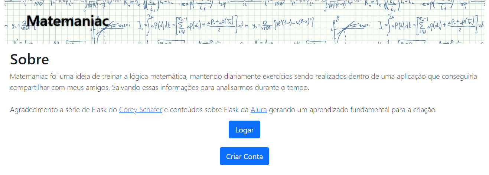

# Matemaniac 🔢

Aplicação criada utilizando Flask, como ORM o SQLAlchemy e banco de dados o MySQL (local).

Surgiu como uma "brincadeira" e acabou saindo em forma de utilizar o conhecimento aprendido em flask, buscando criar uma aplicação que poderia ser utilizada por uma outra pessoa, alguns pontos que ainda precisam ser melhorados, como o armazenamento das informações de forma mais segura.

A logica por trás foi essa:

Montando assim para facilitar na hora de montar as rotas e entender o caminho que o usuario poderia enfrentar.

Já a logica por trás do nosso banco de dados em nossas tabelas foi: 

- db_user
    - id_nickname: chave primaria, é o login do usuario, portanto só pode existir um.
    - password: sua senha, por enquanto está sendo armazenada a senha crua. (mudar em atualização proxima)
    - score: pontuação do usuario, a cada jogo vai de 0 a 10, dependendo da qtde de acertos em cada jogo.
    - qtde_jogos: cada jogo que ele realizar é adicionado 1 nesse atributo, assim conseguimos saber a qtde de questões erradas tbm.
        - qtde_questoes_erradas = ((qtde_jogos * 10) - score)
        - obs: pode ser desconsiderado futuramente, já que conseguimos essa informação pela tabela de jogos (db_game).

- db_game
    - id_game: chave primaria, auto incrementa
    - dia_game: data e tempo da realização daquela questão
    - num_da_tentativa: vai de 0 a 9, assim conseguimos todos os números que foram escolhidos naquele jogo, podendo analisar futuramente qtde de acerto de cada número
    - num_1: primeiro número da multiplicação.
    - num_2: segundo número da mutiplicação.
    - acertou: identifica se aquela tentativa foi bem sucedida.
    - id_nickname: chave estrangeira, faz a ligação com a tabela (db_user).

Homepage:

